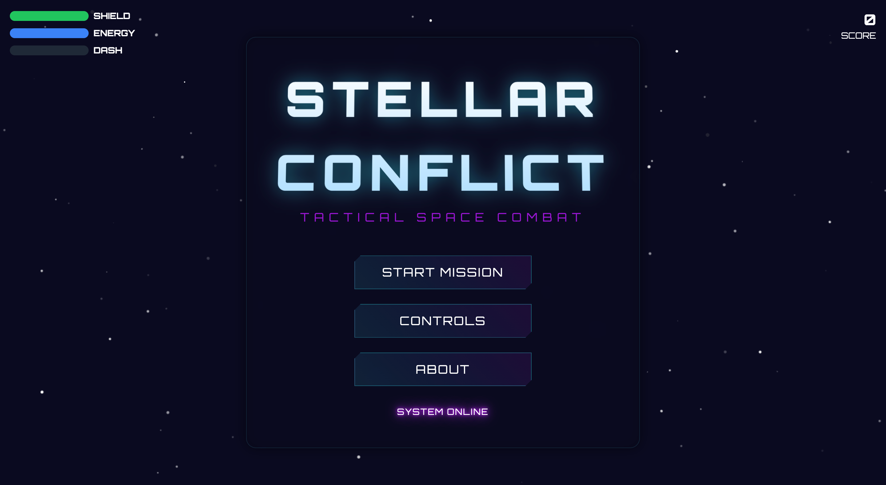

# Stellar Conflict

A modern space shooter game built with JavaScript and HTML5 Canvas. Features optimized performance, modern build system, and modular architecture.

## Features

- Smooth gameplay with optimized performance
- Object pooling for projectiles and explosions
- Spatial partitioning for efficient collision detection
- Visual feedback and effects
- Combo system with score multipliers
- Power-up system (shield, rapid fire, multishot)
- Player upgrade system — earn XP, level up, and choose stat boosts
- Energy regeneration with a guaranteed energy regen boost on every level-up
- Multiple enemy types including the high-speed 'charger' enemy
- Animated starfield parallax background
- Enhanced modal animations for controls and about screens
- Mobile-friendly controls
- State management system
- Asset preloading and caching
- Error handling and recovery
- Pause functionality with options menu

## Tech Stack

- Vite for bundling and development
- TailwindCSS for styling
- ESLint + Prettier for code quality
- Modern JavaScript (ES6+)

## Project Structure

```
stellar-conflict/
├── src/
│   ├── scripts/
│   │   ├── core/           # Core game systems
│   │   │   ├── game.js
│   │   │   ├── renderer.js
│   │   │   └── assetManager.js
│   │   ├── entities/      # Game entities
│   │   │   ├── player.js
│   │   │   ├── enemy.js
│   │   │   ├── projectile.js
│   │   │   ├── powerup.js
│   │   │   └── explosion.js
│   │   ├── states/       # Game states
│   │   │   ├── gameState.js
│   │   │   ├── menuState.js
│   │   │   ├── playingState.js
│   │   │   ├── pausedState.js
│   │   │   └── gameOverState.js
│   │   └── utils/        # Utility functions
│   │       ├── constants.js
│   │       ├── collision.js
│   │       ├── tutorial.js
│   │       ├── audio.js
│   │       ├── storage.js
│   │       ├── achievements.js
│   │       ├── particles.js
│   │       └── helpers.js
│   ├── assets/           # Game assets
│   ├── styles/          # CSS styles
│   └── index.html       # Main HTML file
├── public/             # Static assets
├── dist/              # Production build
└── config files
```





## Getting Started

### Prerequisites

- Node.js 14.0.0 or higher
- npm or yarn
- A modern web browser

### Installation

1. Clone the repository:
```bash
git clone https://github.com/Rahul-Sahani04/Mini-Space-Shooter.git
cd Mini-Space-Shooter
```

2. Install dependencies:
```bash
npm install
```

3. Start development server:
```bash
npm run dev
```

4. Open your browser and navigate to `http://localhost:3000`

### Available Scripts

- `npm run dev` - Start development server
- `npm run build` - Build for production
- `npm run lint` - Lint code

## Building for Production

```bash
npm run build
```

The production build will be in the `dist` directory.

## Development

### Code Style

The project uses ESLint and Prettier for code formatting. Configure your editor to:
- Format on save using Prettier
- Show ESLint errors/warnings

### Making Changes

1. Create a new branch for your feature:
```bash
git checkout -b feature/your-feature-name
```

2. Make your changes and ensure they follow the coding standards:
```bash
npm run lint
```

3. Test your changes:
```bash
make test
```

4. Commit your changes:
```bash
git add .
git commit -m "feat: add your feature"
```

### Adding New Features

- Add new entities in `src/scripts/entities/`
- Add new game states in `src/scripts/states/`
- Add new utilities in `src/scripts/utils/`
- Update tests accordingly

## Contributing

1. Fork the repository
2. Create your feature branch (`git checkout -b feature/AmazingFeature`)
3. Commit your changes (`git commit -m 'feat: add some AmazingFeature'`)
4. Push to the branch (`git push origin feature/AmazingFeature`)
5. Open a Pull Request

## License

This project is licensed under the MIT License - see the LICENSE file for details.

## Acknowledgments

- Space assets from [PixelSpaceRage pack](https://gamedeveloperstudio.itch.io/)
- Sound effects from [Space Music Pack](https://gamedeveloperstudio.itch.io/)
- Font Awesome for icons
- TailwindCSS for UI styling
